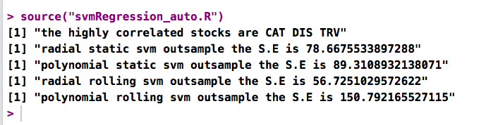

# Final_Project_479  

## Task  
use kernel trick to solve the customized problems  

1. SVM Regression (prediction of future price) 
2. SVM Classification(prediction of future direction)

## Data: Dow Jones Index Stock Sets  

the data link: <https://archive.ics.uci.edu/ml/datasets/Dow+Jones+Index>

**Relevant Papers**  
Brown, M. S., Pelosi, M. & Dirska, H. (2013). Dynamic-radius Species-conserving Genetic Algorithm for 
the Financial Forecasting of Dow Jones Index Stocks. Machine Learning and Data Mining in Pattern 
Recognition, 7988, 27-41.

## How to use 

1. Make sure you have installed Studio.  
2. Double click the `Final_Project.Rproj`  
3. `source("svmRegression_mixed.R")`or other R scripts. 

